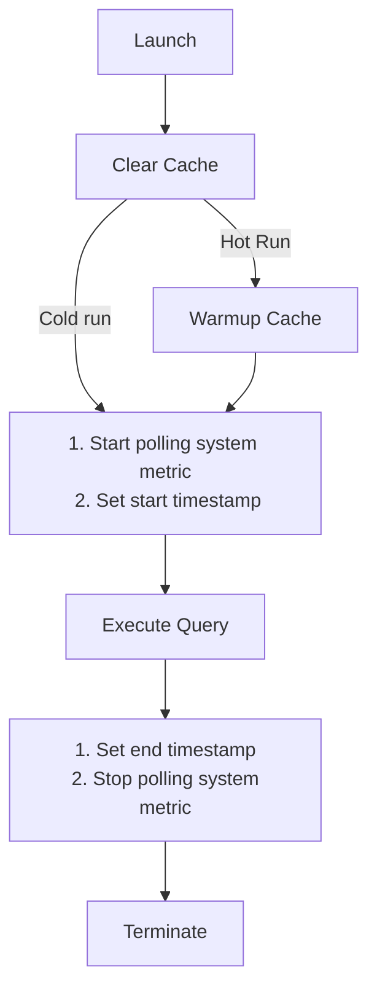

# Methodology

We developed LogArchivalBench to compare various log management tools. The benchmark focuses on two key aspects: Ingestion performance, including data compression ratio, and search performance. Below, we describe our testing process, which metrics we gather, the datasets and queries we use, and the tools we test.
- [Methodology](#methodology)
  - [Testing process](#testing-process)
    - [Ingestion](#ingestion)
    - [Search](#search)
      - [Runtime scenarios](#runtime-scenarios)
    - [Benchmark Machine Specs](#benchmark-machine-specs)
  - [Tested tools](#tested-tools)
  - [Metrics](#metrics)
    - [Ingestion](#ingestion-1)
      - [Compression ratio](#compression-ratio)
      - [Ingestion speed](#ingestion-speed)
      - [Ingestion memory usage](#ingestion-memory-usage)
    - [Search](#search-1)
      - [Query latency](#query-latency)
      - [Search memory usage](#search-memory-usage)
  - [Datasets](#datasets)
  - [Queries](#queries)
    - [MongoDB](#mongodb)

## Testing process

The benchmark is divided into two parts: **ingestion** and **search**. You can read more about the metrics we gather in each portion of the workflow below in the Metrics section. To learn about how to set up and run the benchmarking tool checkout the [README.md](/README.md). To learn how to modify the benchmark checkout [add_a_tool.md](/docs/add_a_tool.md) and [add_a_dataset.md](/docs/add_a_dataset.md).

### Ingestion

1. **Launch**: After building and running the docker image, LogArchivalBench launches the tool being tested inside the docker container.   
2. **Reset**: Before ingesting new data we clear any existing archives or temporary files from previous runs.  
3. **Measure raw dataset size**  
4. **Start Polling System Metric**: Before ingesting the data we start polling for memory usage of the tool. You can read more details of how we poll down in the Metrics section.  
5. **Set start timestamp**  
6. **Ingest** dataset  
7. **Set end timestamp**  
8. **Stop Polling System Metric**  
9. **Measure compressed data size**  
10. **Terminate** the tool

### Search

For Each Query:

1. **Clear caches**: After launching the tool and ingesting the data we clear the system caches and any internal tool caches we can. To see how we clear these caches check the clear\_cache function in each *assets/\<tool name\>main.py*  
2. (Hot Run ONLY) **Warm up caches** \- Run the queries 3 times to warm up the caches  
3. **Start Polling System Metric**: Before searching the data we start polling for memory usage of the tool. You can read more details of how we poll down in the Metrics section.  
4. **Set start timestamp**  
5. **Execute Query**  
6. **Set end timestamp**  
7. **Stop Polling System Metric**  
8. **Terminate** the tool



#### Runtime scenarios

For search we evaluate two runtime scenarios for query benchmarking with each tool:

* **Hot run**: In this scenario, we run the query multiple times to warm up any caches, then execute the query again to measure end-to-end latency.  
  * *Note*: In the future, we plan to warm up the system by running the benchmark until results stabilize before collecting final measurements.  
* **Cold run**: In this scenario, we clear the page cache and any internal cache of the tool (if applicable), then run the query to measure end-to-end latency.

### Benchmark Machine Specs 

| Property | Value |
| ----- | :---: |
| OS | Ubuntu-22.04 |
| CPU | Intel Xeon E5-2630v3  (8 cores, supports hyperthreading) |
| Memory | 128GB of DDR4 |
| Storage | 7200RPM SATA |
| Cores Used | 4 |

\*To emulate a realistic deployment machine, we restrict the benchmark runs to use 4 cores.

## Tested tools 

The tables below list the current set of benchmarked tools, as well as the specific methodology used for each tool.

| Tool | Methodology |
| ----- | ----- |
| [CLP](/assets/clp/) | 📐[Methodology](/assets/clp/methodology.md) |
| [Presto \+ CLP](/assets/presto_clp/) | 📐[Methodology](/assets/presto_clp/methodology.md) |
| [ClickHouse](/assets/clickhouse/) | 📐[Methodology](/assets/clickhouse/methodology.md) |
| [SparkSQL \+ Parquet](/assets/sparksql/) | 📐[Methodology](/assets/sparksql/methodology.md) |
| [Presto \+ Parquet](/assets/presto_parquet/)  | JSON String & Pairwise Array<br> 📐[Methodology](/assets/presto_parquet/methodology.md) |
| [Elasticsearch](/assets/elasticsearch/) | 📐[Methodology](/assets/elasticsearch/methodology.md) |
| [Zstandard](/assets/zstandard/) | (Ingestion Only)<br> 📐[Methodology](/assets/zstandard/methodology.md) |
| [Gzip](/assets/gzip) | (Ingestion Only)<br> 📐[Methodology](/assets/gzip/methodology.md) |


## Metrics

### Ingestion

#### Compression ratio

This is how compact a dataset is, once ingested, which indicates the efficiency of the tested tool’s storage format. Compression ratio is calculated as: 

<div style="text-align: center;">

$\frac{Dataset's\ Uncompressed\ Size}{Dataset's\ Size\ After\ Ingestion}$

</div>

Higher values are better.

#### Ingestion speed

This is how fast the tool is at ingesting a dataset. Ingestion speed is calculated as:

<div style="text-align: center;">

$\frac{Dataset's\ Uncompressed\ Size}{Time\ to\ Ingest}$

</div>

Higher values are better.

#### Ingestion memory usage

This measures the average memory usage during ingestion. Smaller values are better indicating lower resource usage.

We use `ps` to poll the `RSS` (resident-set size) field for all related processes, then average the results.

### Search

#### Query latency

This is how long the queries take to execute in seconds. Smaller values are better indicating faster query performance. 

#### Search memory usage

This measures the average memory usage while running the queries in GB. Smaller values are better indicating lower resource usage.

See the Ingestion Memory Usage section above to see how we capture memory usage.

## Datasets

**Structured logs** follow a predefined format, making them parseable, but their schema is not rigid. Their log events usually have a few consistent fields (e.g., the event's timestamp and log level) but the rest may appear and disappear across each event. For example, the `isInternalClient` and `timeoutMillis` fields are dynamic.

Example:

```json lines  
{
    "t":"2023-03-21T23:34:54.576-04:00",
    "s":"I",
    "msg":"Initialized wire specification",
    "isInternalClient":true
}  
{
    "t":"2023-03-21T23:35:12.123-04:00",
    "s":"W",
    "msg":"Connection timeout",
    "timeoutMillis":5000
} 
``` 


For this benchmark we use multiple structured datasets.

| Dataset | Size | Number of Events | Link |
| ----- | ----- | ----- | ----- |
| MongoDB | 64.8 GiB | 186,287,600 | [Link to dataset](https://zenodo.org/records/10516284) |
| Elasticsearch | 7.98 GiB | 14,001,234 | [Link to dataset](https://zenodo.org/records/10516226)  |
| CockroachDB | 9.79 GiB | 16,520,377 | [Link to dataset](https://zenodo.org/records/10516386)  |
| PostgreSQL | 393 MiB | 1,000,000 | [Link to dataset](https://zenodo.org/records/10516401)  |
| Spark-events-logs | 1.98 GiB | 1,011,651 | [Link to dataset](https://zenodo.org/records/10516345)  |

* **MongoDB** \- Contains log events generated by MongoDB when running [YCSB](https://github.com/brianfrankcooper/YCSB) workloads A-E repeatedly. 

* **Elasticsearch** \- Contains logs from an Elasticsearch server instance. The logs were generated by using Elasticsearch to index another JSON dataset.

* **CockroachDB** \- One node’s JSON log events from a three-node CockroachDB cluster. The logs were generated by running [YCSB](https://github.com/brianfrankcooper/YCSB) workloads repeatedly for three days.

* **PostgreSQL** \- A sample of JSON log events from a PostgreSQL instance. The logs were generated by repeatedly running [YCSB](https://github.com/brianfrankcooper/YCSB) workloads A-E.

* **Spark-events-logs**  \- Event logs (JSON) from a Spark cluster. The logs were generated by repeatedly running selected workloads from the [HiBench Benchmark Suite](https://github.com/Intel-bigdata/HiBench) over six days.

## Queries

For search performance, we use the following query set. Currently, only the MongoDB dataset is queried, but we plan to benchmark the other datasets in the future. For each dataset that we query you’ll find a table with English explanations of each query and an example of the query in SQL. Since each tool may use a different query language you can find a table containing a link to the queries formatted for use in each tool. 

### MongoDB

We use 6 queries for this dataset. We chose to query a combination of dynamic and static attributes for coverage and the first and last query should give the same result, which can be used to test for any errors. 

<table>
<tr>
    <td></td>
    <td> Explanation </td>
    <td> Query Example (SQL Format) </td>
</tr>
<tr>
    <td> Q1 </td>
    <td> Query all JSON log lines containing "attr" object with "tickets" field </td>
    <td>

```sql
SELECT * FROM benchmark 
WHERE attr.tickets IS NOT NULL;
```
</td>
</tr>
<tr>
    <td> Q2 </td>
    <td> Query all JSON log lines containing "id" field that equals to 22419 </td>
    <td>
    
```sql
SELECT * FROM benchmark 
WHERE id = 22419;
```
</td>
</tr>
<tr>
    <td> Q3 </td>
    <td> Query all JSON log lines containing "attr" object with a nested "message" object with a "msg" field that starts with "log_release" and a "session_name </td>
    <td>
    
```sql
SELECT * FROM benchmark 
WHERE attr.message.msg LIKE "log_release%" 
AND attr.message.session_name = "connection";
```
</td>
</tr>
<tr>
    <td> Q4 </td>
    <td> Query all JSON log lines where "ctx" is "initandlisten" and either "msg" does not equal to  "WiredTiger message" or "attr.message.msg" starts with "log_remove" </td>
    <td>
    
```sql
SELECT * FROM benchmark 
WHERE ctx = "initandlisten" 
AND (
    msg != "WiredTiger message" 
    OR 
    attr.message.msg LIKE "log_remove%"
    ); 
```
</td>
</tr>
<tr>
    <td> Q5 </td>
    <td> Query all JSON log lines where "c" is "WTWRTLOG" and "attr.message.ts_sec" is greater than 1679490000 </td>
    <td>
    
```sql
SELECT * FROM benchmark 
WHERE c = "WTWRTLOG" 
AND attr.message.ts_sec > 1679490000;
```
</td>
</tr>
<tr>
    <td> Q6 </td>
    <td> Query all JSON log lines where "ctx" is "FlowControlRefresher" and "attr.numTrimmed" equals 0 </td>
    <td>
    
```sql
SELECT * FROM benchmark 
WHERE ctx = "FlowControlRefresher" 
AND attr.numTrimmed = 0;
```
</td>
</tr>
</table>

| Tool | Query File |
| ----- | ----- |
| [CLP](/assets/clp/) | 📐[CLP Config File](/assets/clp/config.yaml) |
| [Presto \+ CLP](/assets/presto_clp/) | 📐[Presto \+ CLP Config File](/assets/presto_clp/config.yaml) |
| [ClickHouse](/assets/clickhouse/) | 📐[ClickHouse Config File](/assets/clickhouse/config.yaml) |
| [SparkSQL \+ Parquet](/assets/sparksql/) | 📐[SparkSQL Config File](/assets/sparksql/config.yaml) |
| [Presto \+ Parquet](/assets/presto_parquet/)  | JSON String & Pairwise Array<br> 📐[Presto \+ Parquet Config File](/assets/presto_parquet/config.yaml) |
| [Elasticsearch](/assets/elasticsearch/) | 📐[Elasticsearch Config File](/assets/elasticsearch/config.yaml) |